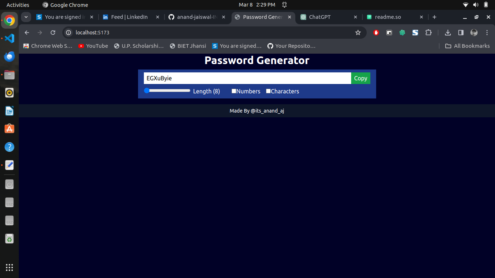

# React Password Generator App

This is a password generator app implemented using React and Vite. The app provides options to customize the generated password by changing its length, including numbers, and including special characters. The app demonstrates the usage of different React hooks for state management and functionality.

## Screenshots



## Features

- Generate random passwords with customizable options.
- Copy the generated password into your clipboard.
- Change password length dynamically.
- Checkbox options to include numbers and special characters in the password.
- Built with React and Vite for efficient development and performance.

## Getting Started

To get started with this project, follow these steps:

1. Clone the repository:

```bash
git clone https://github.com/anand-jaiswal-IN/passwordGeneratorApp.git
```

2. Navigate to the project directory:

```bash
cd passwordGeneratorApp
```

3. Install dependencies:

```bash
npm install
```

4. Start the development server:

```bash
npm run dev
```

5. Open your browser and visit [http://localhost:3000](http://localhost:3000) to view the app.

## Usage

- Use the options provided to customize the password generation:
  - Adjust the length of the password using the length slider.
  - Toggle the inclusion of numbers by checking or unchecking the "Include Numbers" checkbox.
  - Toggle the inclusion of special characters by checking or unchecking the "Include Special Characters" checkbox.
- The password will update automatically based on the selected options.

## Technologies Used

- React
- Vite
- Tailwind classes

## Folder Structure

```
password-generator-app/
│
├── index.html
│
├── src/
│   ├── App.jsx
│   ├── index.css
│   ├── main.js
│   ├── ...
│
├── .gitignore
├── package.json
├── README.md
└── ...
```

## Contributing

Contributions are welcome! Feel free to open an issue or submit a pull request.

## Thanks

Thankyou for visiting my repository to check my project. Feel free to explore more project on my Github. Your support are required to push myself. ❤️
